# AA-CAES

选择合适的储能系统可以在很大程度上提高风力发电的技术和经济竞争力，同时提供更高的系统灵活性覆盖电力需求。大规模电力储存系统能够通过负载均衡来优化风电的消耗，这意味着在低需求时期储存电力，并在高峰需求时期供应， 将非定期的低价值电力转化为高价值产品。

## AA-CAES 常规系统

AA-CAES在运行过程中没有碳排放，它不依赖任何化石燃料来回收储存的电力。

基本思想是将压缩时以热的形式排出的能量回收，并在以后的膨胀阶段将其重新用于重新加热储存的空气，从而从常规循环中省去燃烧室。热能存储(TES)存储从压缩阶段回收的热量，它作为一个中间冷却器，降低压缩空气的温度 ，因此能够使用低成本的地下水库。在排放过程中，空气被高压涡轮入口重新加热到所需的温度。

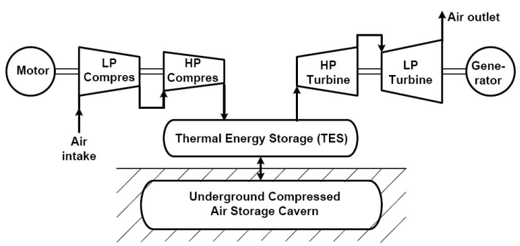

考虑TES本身的热损失，以及洞室的热损失。这些热损失降低了再加热空气时可以达到的温度，因此在整个排放时间内无法保证涡轮入口温度。由于在系统排放时，涡轮入口温度正在下降，因此需要减小压差，以避免空气压力过低。

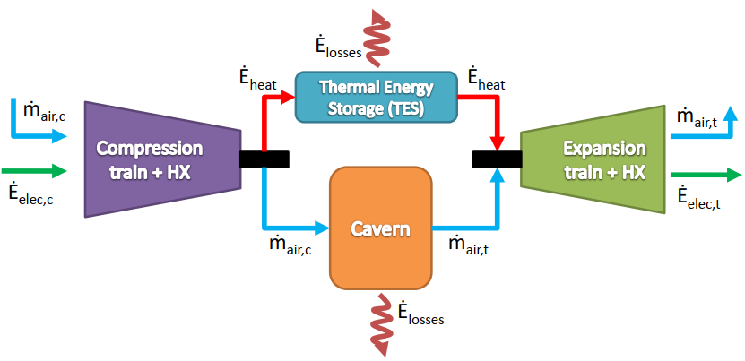

第一个模块处理大气空气的压缩和提取因压缩而排出的热量。第二个和第三个模块分别代表热量和空气存储。第四个是空气的再加热和它的膨胀通过燃气涡轮。热能储存(TES)系统负责储存热量，这些热量通过热能传递流体(HTF)从模块1传递到模块4。

It is important to remark that since we are dealing with an **adiabatic system**, the expansion module does not involve any fuel use. 

**等温和绝热变换**(Isothermal and adiabatic transformations)在膨胀和压缩阶段中实际上是**不可行**的，因此我们将它们建模为**多向变换**(polytropic transformations)，这是可行的，因为总是会有一些温度变化，以及与周围的一些热交换。

压缩空气通过逆流热交换器冷却，洞室内空气压力与压缩机组输出相同。管道或热交换器**不涉及压力损失**。

### Compression Stage

Compression Stage由四个压缩机和四个热交换器组成的压缩机列组成。大气空气被第一个压缩机压缩，然后进入热交换器，在那里热空气将一部分热量传递给HTF。在此之后，空气进入下一个压缩机 ，这个过程不断重复，直到到达最后一个压缩机。由于盐洞的性质，空气不能储存在高温下，因此空气通过第四个热交换器在进入地下储存之前再次降低温度。

the inlet and outlet pressures of the air

consider the air compression to be polytropic

The temperature of the air increases due to the polytropic transformation

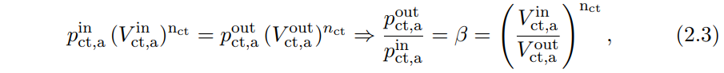

The usage of the ideal gas law 

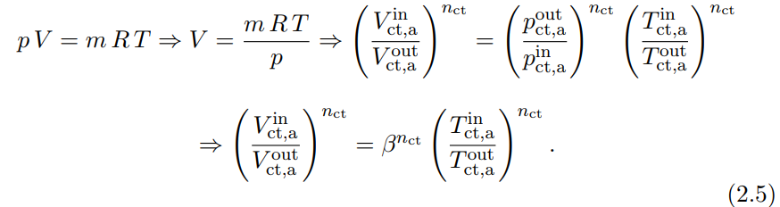

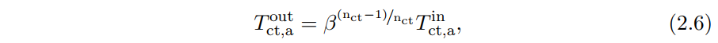

这是**压缩机列**后的空气温度。但是，要 计算每台压缩机(Tout,c)后的空气温度，需要用压缩比的指数除以压缩机的数量。因此，一个压缩机级后的空气温度为

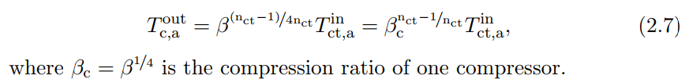

 the power consumed by each compressor follows the equation

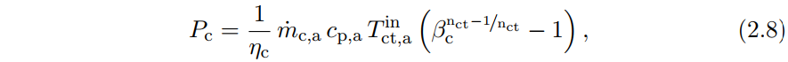

each heat exchanger (HX)during the compression stage

## AA-CAES 储备调度模型

参照论文"A reserve capacity model of AA-CAES for power system optimal joint energy and reserve scheduling"

Compressed Air Energy Storage(CAES), Pumped Hydro Storage (PHS), batteries, pumped thermal electricity storage and liquid air energy storage 

C-CAES 不足之处：循环效率低、释能过程需要消耗化石燃料

Advanced Adiabatic Compressed Air Energy Storage(AA-CAES) ：

- Compression: 高压空气储存在air reservior储气库中，压缩热储存在heat reservoir储热器中。
- Expansion: 热量可以重复使用，也就是储热器中的热量用来加热HEXs中的加压空气用于发电，为发电提供多级涡轮发电(drive a multi-stage turbine for e generation)

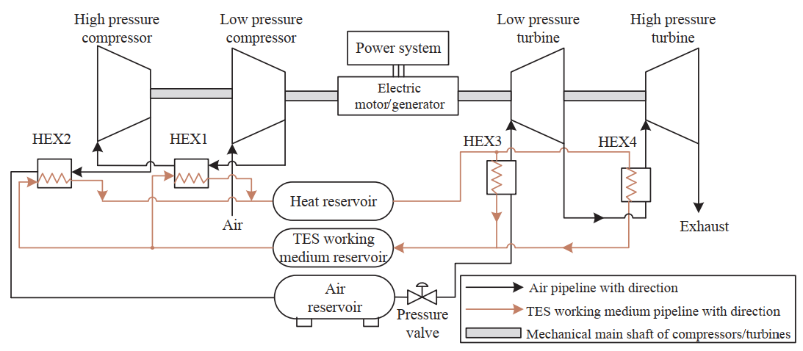

多级空气压缩单元(低压和高压压缩机)、多级空气膨胀单元(低压和高压涡轮)、电动机/发电机、热交换器(HEXs)、储热器、热能存储(TES)工质储热器和空气储热器。

比较：与前一次仿真的C-CAES系统相比多了**"Heat reservoir" and "TES working medium reservior"**

the optimal operation strategy of C-CAES ?

利用电力市场价格作为不确定参数,提出了一种利用鲁棒优化方法对商人C-CAES进行报价和选择策略。

**风力发电和C-CAES组合系统的最优自调度策略**[22]

C-CAES具有减轻风衰减的能力，提供负载转移服务，降低系统运行成本，但没有分析C-CAES提供**备用服务**的性能

**操作储备**对电力系统至关重要,因为它们被用来确保电力系统的**运行可靠性**

为了最大化AA-CAES的技术和经济效益，对**AA-CAES操作的能源和储备调度模型**的研究是相当重要的。
An optimal joint energy and reserves scheduling model for the power system with an AA-CAES facility

---

Model formulation of AA-CAES systems for energy and reserve scheduling

2.1. Modelling of AA-CAES energy scheduling constraints

The compressing power and generating power

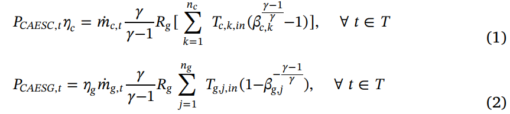

Considering the heat transfer between the air reservoir and the atmosphere, the change rate of air pressure in the air reservoir.

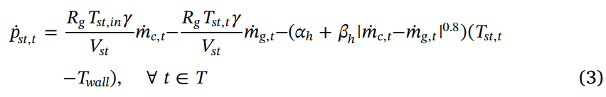

 The air pressure in the air reservoir

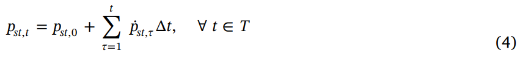

The heat transfer power of HEXs during the compression stage and the expansion stage

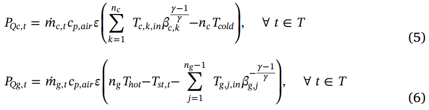

The stored heat in the heat reservoir

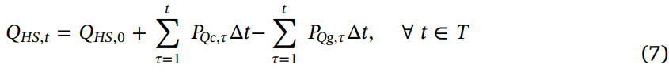

2.2. Reserve capacity model of AA-CAES

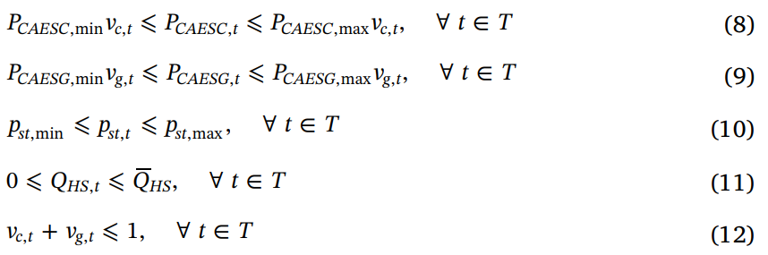

