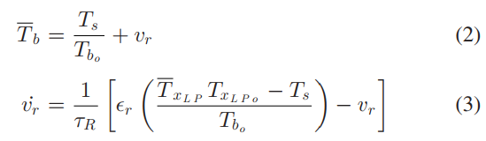

# C-CAES

"Compressed Air Energy Storage System Modeling for Power System Studies"

cavern, turbine, compressor, generator, motor, and controls. 

基于德国Huntorf的非绝热CAES(diabatic CAES)：考虑两个独立的同步机器(发电机和电机)，探索电网CAES系统的全部潜力

本文提出详细模型和简化模型，首先采用阶跃响应进行评估，然后在具有高风力发电渗透率的电力系统上进行演示，以说明CAES系统的频率调节能力。

## Overview

CAES系统比使用燃气轮机的联合循环发电厂有很大的优势，因为后者使用60%-70%所产生的机械能的用于驱动空压机，而前者则使用来自电网的剩余电力。这意味着，与传统的联合循环发电电厂相比，注入CAES系统的每单位气体产生的电量更多。CAES系统的**斜坡速率**(ramp rates)也优于等效燃气 涡轮电厂

- Charging/Compression mode: 电网的剩余电力提供动力，电机驱动compressor对空气进行加压，空气通过管道输送，在中间冷却器(intercoolers)和后冷却器(aftercooler)中冷却【降低温度，提高压缩效率】，并储存在【隔热？】cavern(insulated reservoir)。随着空气的注入，储层(reservoir)的内部压力和势能增加
- Discharging mode: 【因为turbines涡轮的工作效率取决于空气的温度和压力】，所以储存的空气在回热器(recuperator)中被预热，然后在燃烧器(burner)中与气体结合后被膨胀；(Adiabatic CAES不需要燃料，而只需要用 heat storage subsystem加热)。同步发电机的转子由expander带动来发电。
- Idling mode(怠速): the CAES system is neither charging nor discharging. 

**Motor/Generator**

**Compressor**: 低压轴向压缩机、高压多级离心式压缩机。压缩后安装调节阀，将压缩压力节流至实际洞室压力。在Huntorf中，使用了三个中间冷却器和一个后冷却器

**Turbine**: 在非绝热CAES系统中，涡轮(turbine)主要有燃烧室(或燃烧器)和膨胀器。从洞室出来的空气，利用膨胀机低压排风的余热，在回热器中进行预热，提高效率。然后与燃料结合，在高压燃烧室中燃烧，以达到高压膨胀器所需的入口温度（高压膨胀器入口温度有下限，因为如果温度过低，高压空气膨胀做功时会产生液体，影响膨胀机的效率和安全）。之后，空气在低压燃烧器中再加热，并在低压膨胀器中膨胀;再加热增加了膨胀循环的效率，因为膨胀功与涡轮的入口温度成正比。

Turbine mode: 

- constant input pressure: 空气被节流，使燃烧器进口压力保持不变
- variable input pressure: 燃烧器进口压力就是洞穴压力

**Cavern**: low overall cost, and leak-proof characteristics

**Control System**: 通过控制expansion阶段的空气质量流量来实现所需的输出功率，同时通过控制燃烧器中的燃料(两个控制回路)来保持膨胀器(低压和高压)的**入口温度恒定**。压缩空气流量是通过移动压缩机的可变入口导叶来调节的(variable inlet guide vanes, IGVs)，以**控制电能**。

**clutches**(离合器) are added so that the compression and expansion stages are separately connected to the generator

至于CAES循环的修改，其目标是增加工厂的热速率以及它的多功能性。包括添加或替换热力学循环的膨胀阶段的元素，创建具有不同应用的新循环。比如：回收循环(用于麦金托什工厂)，蒸汽注入循环，加湿压缩空气储存(CASH)和 先进绝热CAES循环(AA-CAES)。

---

**Energy density of compressed air**

理想气体方程
$$
pV=nRT\\
$$
The gas exerts a normal force and the work
气体膨胀，dV为正，做功为正
$$
F=pA\\ 
\delta W=pA\cdot dx = p\cdot dV \\
W=\int_{V_1}^{V_2} p dV\\
$$
isothermal compression process(等温压缩过程)
the Boyle-Mariotte's law(玻伊尔-马里奥特定律)
$$
pV=nRT=constant\\
W=-\int_{V_1}^{V_2} p dV = nRT\int_{V_1}^{V_2} \frac{dV}{V} = nRT \ln(\frac{V_1}{V_2})\\
$$

## Modeling

Most of variables are expressed in per-unit

燃料空气比值小

理想气体假设：$\Delta h=c_p \Delta T$

假设流体在所有容器内稳定流动，过程中动能和势能的变化可以忽略不计：$q-W=\Delta H$

### Discharging/Expansion Mode

**Recuperator**(回热器): 逆流热交换器。洞穴出来的空气进入冷侧$T_s$，热侧用废气余热供给，最后在出口达到$T_b$

换热过程的有效性$\epsilon_r$

一般假设热侧、冷测流量相同，$T_b$近似一阶过程

**Combustion Chambers or Burners**: 膨胀器入口温度随着注入燃烧器的燃料量的增加而升高，并随着$\dot{m}_t$的增加而降低。

**Expander**:  isentropic air expansion(**等熵**空气膨胀)，然而，实际涡轮偏离了等熵理想，这可以用等熵效率η解释

the heat capacity ratio $\gamma=c_p/c_V$, the turbine’s stage pressure ratio $\pi_{tk}$

传递给发电机轴的总机械功率可计算为各膨胀段进出口焓变化率之差之和

如果将焓(enthalpy)表示为比焓乘以质量，那么涡轮的机械功率就变成了质量变化率和涡轮进出口温差的函数。

**Synchronous Generator**: 

**Control System**:

### Charging/Compression Mode

